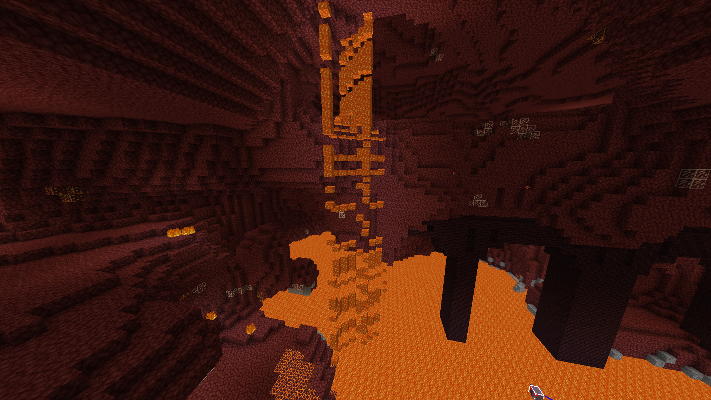

# PacketDiscard

PacketDiscard is a *server-side* mod that discards (doesn't send) 50% of packets the server tries to send, except for the essential ones like login packets, Chunk load packets and keep-alive packets.

Thanks to YTG1234 for [PacketIgnore](https://modrinth.com/mod/packetignore), the mod that inspired me to make this one.

## Example

Here is an example of what to expect going into this:

Please note that this example only scratches the surface of all the things that can happen. The only reason I didn't provide any other screenshots is because I didn't think the other ones were great examples, and because I'm too lazy to make more.

If anyone has any crazy screenshots, feel free to make a pull request to add them to this readme.
